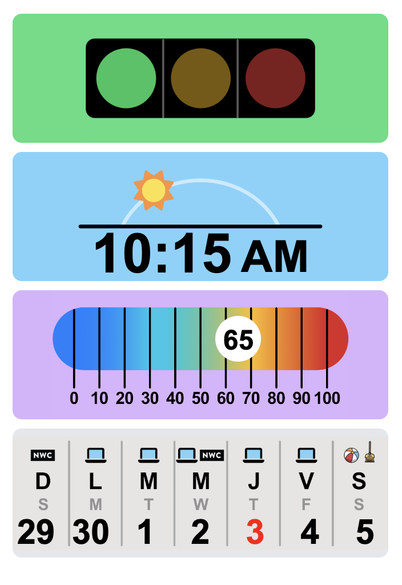
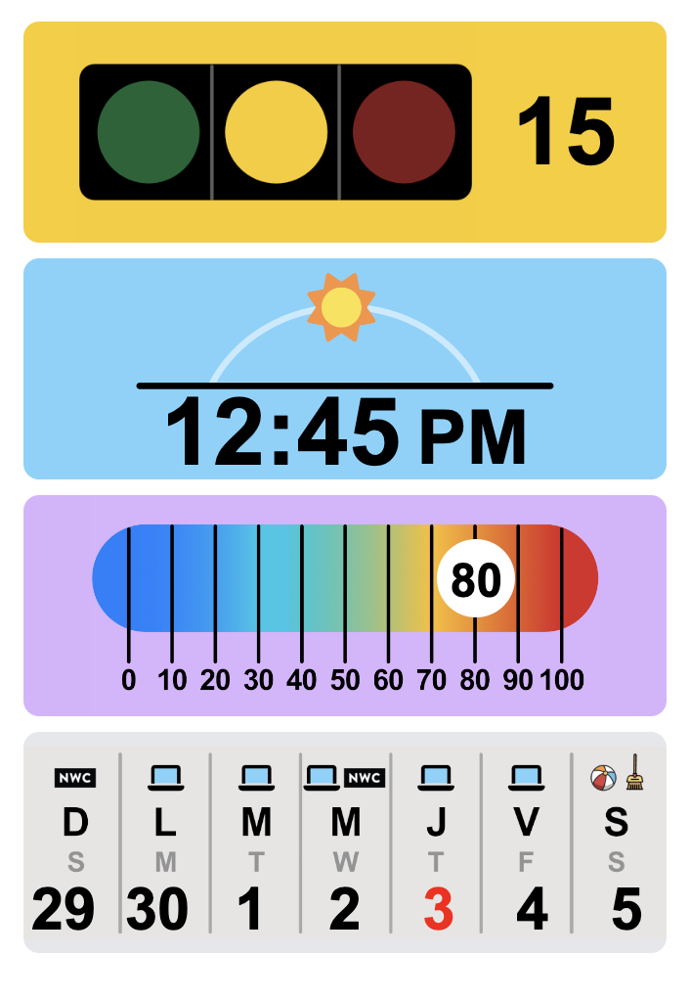
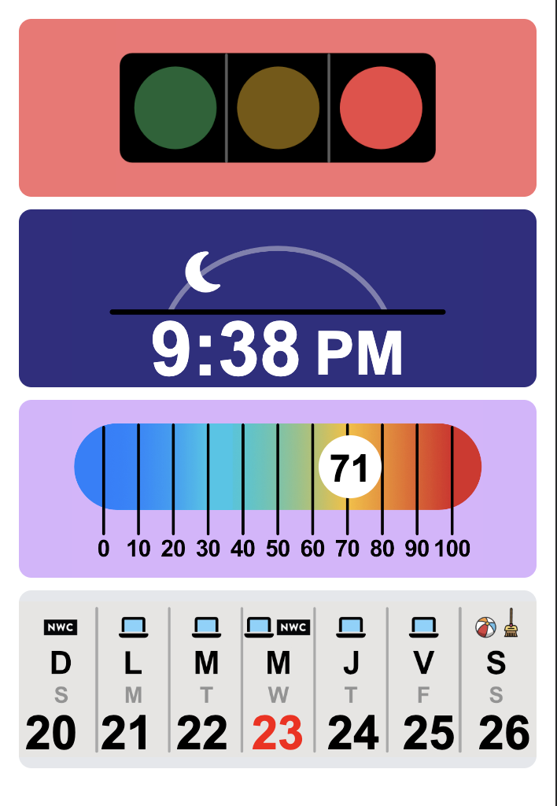
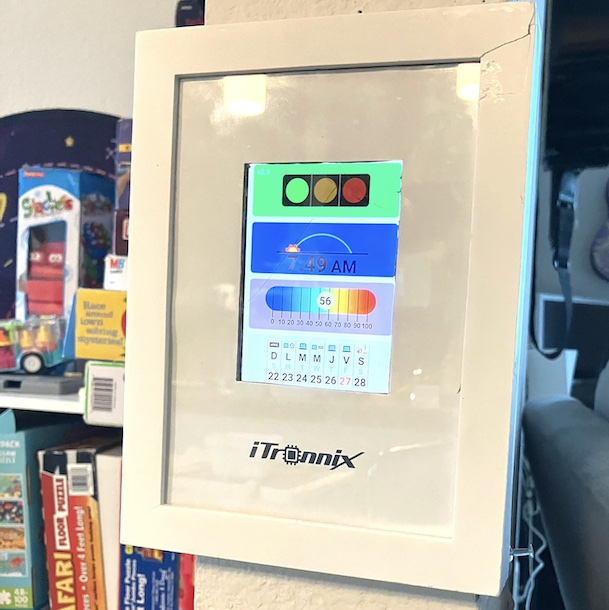
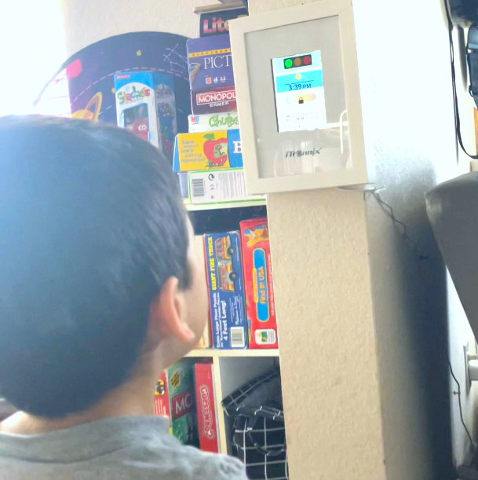

# DashTodd - Time/Weather Dashboard for Toddlers

## Project Description

DashTodd is a web app I developed to help my curious toddler with understanding the time, weather, and calendar. My child used to ask endless questions like "Is it cold outside?", "Can I go out and play?", "How much longer until nap time?", "What day is it?", "What are we going to do today?". These questions sparked the idea for DashTodd, which not only answers these questions but also helps my child follow a routine.

I've set it up on an old phone mounted inside a frame to resemble a dashboard, hanging on the wall. The app runs continuously, updating in real-time, just like a clock. It has been a game-changer in helping my child grasp concepts of time, weather, and daily structure.

## Features

- **Dynamic Clock and Visuals**:
  - Displays the current time in a 12-hour format, updating every second.
  - Adjusts the background and associated visuals to reflect the position of the sun based on the time of day (morning, afternoon, evening, night).

- **Traffic Light**:
  - Changes colors based on specific time ranges during the day to communicate time to play (green), time to prepare (yellow), time to sleep (red).

- **Real-Time Temperature Display**:
  - Fetches and displays the real-time temperature from API, updates every 30 minutes and moves a thermometer slider according to the temperature.

- **Weekly Calendar**:
  - Automatically updates and highlights the current day of the week.

- **Night Mode**:
  - A "curtain" effect is shown during night hours (10:00 PM - 6:00 AM) to simulate screen off.

## Technologies Used

- HTML
- Tailwind.css
- Vanilla JavaScript

## Weather API Used
Visual Crossing Web Services

<table>
  <tr>
    <td>
      
    </td>
    <td>
      
    </td>
    <td>
      
    </td>
  </tr>
  <tr>
    <td>
      
    </td>
    <td>
      
    </td>
    <td>
    </td>
  </tr>
</table>
